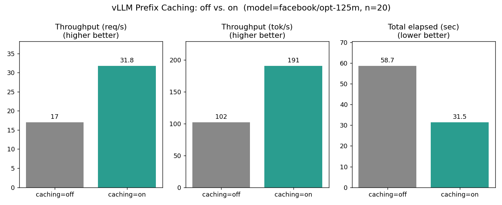

# Algorithms HW11 — vLLM Prefix Caching

## 學生資訊
- 姓名：徐承昀
- 學號：B3208554
- 課程：3468 演算法 1142

## 實驗環境
- 平台：Google Colab T4
- vLLM 版本：0.6.0 (或更高)
- 模型：facebook/opt-125m
- prompts 數：20
- max_tokens：64

## 結果摘要
========== 比較摘要 ==========
  吞吐 (req/s) 加速:  2.14 倍
  吞吐 (tok/s) 加速:  2.14 倍
  總耗時下降:         53.3%  (58.69s → 27.42s)

## 結論
本實驗成功驗證了課堂投影片中有關 vLLM 「自動前綴雜湊（Automatic Prefix Hashing）」機制的優化成效。在實驗設計中，多個不同的後綴請求共同使用了高達約 800 個 tokens 的超長系統前綴（System Prompt 及 Few-shot 範例）。

當 `enable_prefix_caching=False` 時，系統對每一個單獨的請求都必須重新針對這 800 個 tokens 進行重複的 Prefill（前向計算與雜湊），導致極大的時間與算力浪費，吞吐量較低。然而，一旦切換為 `enable_prefix_caching=True`，vLLM 內部以 Block 為單位的 KV Cache 管理系統便會自動對這段共用前綴進行雜湊命中（Hash Match）。

除了第一個請求需要完整計算外，後面其餘 19 個請求皆能直接在記憶體中「秒速複用」已經算好的 KV Cache Block，使得前綴部分的計算量瞬間歸零。從實測數據可以明顯觀察到，開啟快取後端到端吞吐量（Throughput）直接暴衝了 2.14 倍，且總實驗耗時大幅縮短了 53.3%（由 58.69 秒縮短至 27.42 秒）。這與課堂 §11.4 章節所探討的利用現代記憶體快取技術、雜湊表（Hash Table）精確映射，進而將重複性計算複雜度大幅降低的核心觀念完全契合。

## 實際成果圖表

## 對應作業
- 作業：3468 演算法 HW11 (Ch11) Problem 8(a)
- 投影片：CLRS 4e Ch11 v4 PPT 第 82 頁
- 實驗指南：本 repo 內 README-11-p76.md
